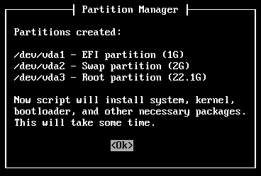
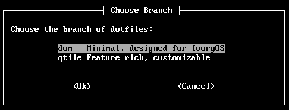
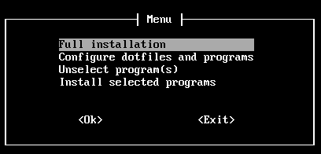
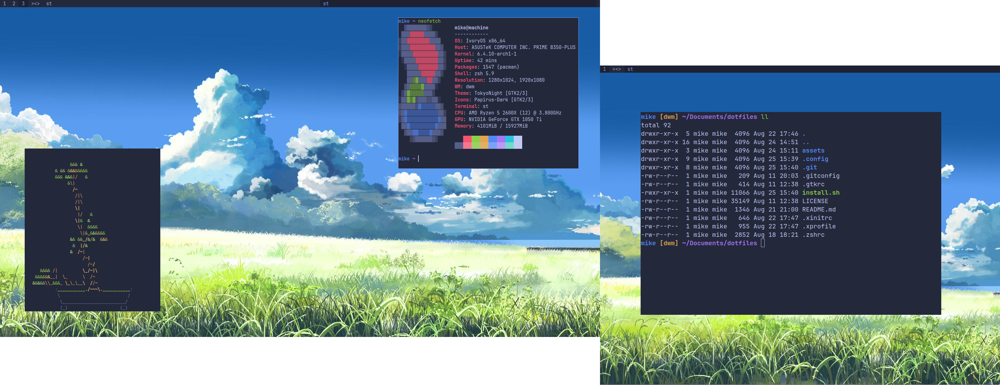

# IvoryOS - Arch based GNU/Linux distribution








## Features
- ~~Sane~~ My defaults
- User input required only for necessary interactions while installing
- TUI installation and customization process using [Whiptail](https://en.wikibooks.org/wiki/Bash_Shell_Scripting/Whiptail)

## System installation

### Stages of installation
- Stage 1 - minimal Arch setup<br>
    User can choose either to partition disk(s):
    - Automatically - Disk partitioning is predefined, meaning that it will look like that:<br>
      **ONLY ONE DISK:**<br>
      Partition 1 = EFI 1 GB,<br>
      Partition 2 = SWAP user-defined (more than 1 GB),<br>
      Partition 3 = ROOT rest of the disk space.

    - Manually - `cfdisk` will be run on all disks, then user will be prompted to run one command at time to format and mount created partitions.

    User will be prompted to enter the name and password of the newly created user, which will have sudo privileges (the don't-ask type). The user will have to choose the [dotfiles branch](https://github.com/piotr-marendowski/dotfiles) which will be run on the first boot.

- Stage 2 - Advanced (or not) system configuration (choose programs to install, and configure dotfiles)


## ISO Download on [SourceForge](https://sourceforge.net/projects/ivoryos/files/) (not really working), working version on tag 0.9-beta

## Building
```
# install archiso
sudo pacman -S archiso
# clone this repository
git clone https://github.com/piotr-marendowski/ivoryos.git
# enter it
cd ivoryos
# compile new iso (building dir/, iso folder/, archiso profile dir/)
sudo mkarchiso -v -w build/ -o iso/ releng/
# to recompile you need to delete the building directory or provide new
```
