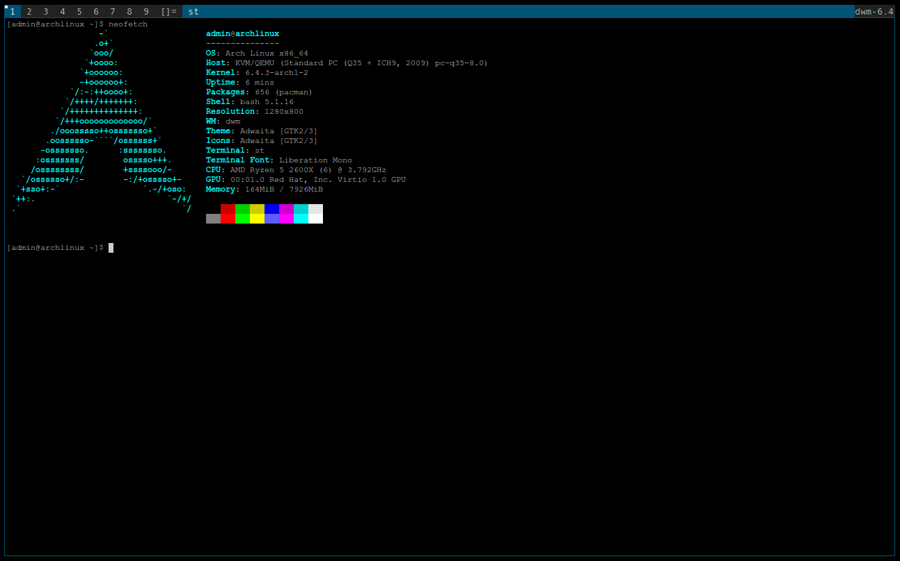

# IvoryOS - Arch based Linux distribution

The whole installation and configuration takes from a few hours to a few minutes (depends on the internet speed). Made it for me to have my own distro with my own defaults. The whole project is WIP.

## Screenshots


placeholder, dwm will be riced :3


## Features
- Sane defaults (for me at least)
- Easy installation, in a GUI-like setup wizard
- User input required only for necessary interactions
- TUI installation and customization process using [Whiptail](https://en.wikibooks.org/wiki/Bash_Shell_Scripting/Whiptail)

## System installation
### Disk layout
Disk partitioning is predefined, meaning that it will look like that:
ONLY ONE DISK: Partition 1 = EFI 1 GB, partition 2 = SWAP user-defined (more than 1 GB), partition 3 = ROOT rest of the disk space.

### Stages of installation
- Stage 1 - minimal Arch setup
- Stage 2 - User's advanced (or not) system configuration (choose programs to install, and configure dotfiles)

## ISO Download
[SourceForge](https://sourceforge.net/projects/ivoryos/files/)

## Building
```
# install archiso
sudo pacman -S archiso
# clone this repository
git clone https://github.com/piotr-marendowski/ivoryos
# enter it
cd ivoryos
# compile new iso (building dir/, iso folder/, archiso profile dir/)
sudo mkarchiso -v -w build/ -o iso/ releng/
# to recompile you need to delete the building directory or provide new
```
